# RentAI ERD
> Generated by [`prisma-markdown`](https://github.com/samchon/prisma-markdown)

- [default](#default)

## default

```mermaid
erDiagram
"users" {
  String id PK
  String name
  String email UK "nullable"
  String phone UK "nullable"
  String password_hash "nullable"
  String google_id UK "nullable"
  String avatarUrl "nullable"
  String roles
  Boolean isHost
  Boolean verifiedEmail
  Boolean verifiedPhone
  Decimal ratingAvg
  Int ratingCount
  DateTime createdAt
  DateTime updatedAt
  DateTime suspended_at "nullable"
  DateTime trust_reviewed_at "nullable"
  String manual_trust_tier "nullable"
  Float home_lat "nullable"
  Float home_lng "nullable"
  String home_city_name "nullable"
  Int quality_score
  DateTime quality_updated_at "nullable"
  Int renter_trust_score
  DateTime renter_trust_updated_at "nullable"
  String id_document_url "nullable"
  DateTime id_submitted_at "nullable"
  DateTime id_verified_at "nullable"
  String id_verified_by "nullable"
  DateTime id_rejected_at "nullable"
  String id_rejection_reason "nullable"
  Float preference_vector
  DateTime preference_vector_updated_at "nullable"
}
"refresh_tokens" {
  String id PK
  String user_id FK
  String token_hash UK
  DateTime expires_at
  DateTime revoked_at "nullable"
  DateTime created_at
  String ip_address "nullable"
  String user_agent "nullable"
}
"wishlist_items" {
  String id PK
  String user_id FK
  String listing_id FK
  DateTime created_at
}
"whatsapp_conversations" {
  String id PK
  String phone_number UK
  String user_id "nullable"
  String last_query "nullable"
  String last_result_ids
  Json last_filters "nullable"
  DateTime last_message_at
  Int message_count
  DateTime created_at
}
"notifications" {
  String id PK
  String user_id FK
  String kind
  String title
  String body "nullable"
  String link "nullable"
  Json payload "nullable"
  DateTime read_at "nullable"
  DateTime created_at
}
"password_reset_tokens" {
  String id PK
  String user_id FK
  String token_hash UK
  DateTime expires_at
  DateTime consumed_at "nullable"
  DateTime created_at
  String ip_address "nullable"
}
"category_requests" {
  String id PK
  String requester_id FK
  String proposed_name
  String reason "nullable"
  CategoryRequestStatus status
  String admin_notes "nullable"
  String resolved_category_id FK "nullable"
  DateTime createdAt
  DateTime updatedAt
}
"categories" {
  String id PK
  String name
  String slug UK
  String icon "nullable"
  Boolean allowed_for_private
  Boolean is_active
  DateTime createdAt
}
"listings" {
  String id PK
  String hostId FK
  String title
  String description
  String categoryId FK
  String images
  Decimal pricePerDay
  String address
  String rules "nullable"
  Json availability "nullable"
  Boolean isActive
  ListingStatus status
  BookingType bookingType
  Int min_nights
  String ical_import_url "nullable"
  Boolean near_beach "nullable"
  String property_type "nullable"
  Int guests_capacity "nullable"
  Int bedrooms "nullable"
  Float rating_avg
  Int booking_count_30d
  Int quality_score
  DateTime quality_updated_at "nullable"
  CancellationPolicy cancellation_policy
  Boolean dynamic_pricing
  Decimal base_price_per_day "nullable"
  DateTime dynamic_pricing_at "nullable"
  Float embedding
  DateTime embedding_updated_at "nullable"
  DateTime deletedAt "nullable"
  DateTime createdAt
  DateTime updatedAt
}
"listing_availability_blocks" {
  String id PK
  String listing_id FK
  DateTime start_date
  DateTime end_date
  String note "nullable"
  String source
  String external_uid "nullable"
  DateTime created_at
}
"listing_date_prices" {
  String id PK
  String listing_id FK
  DateTime date
  Decimal price
  DateTime created_at
  DateTime updated_at
}
"user_interactions" {
  String id PK
  String user_id FK
  String listing_id FK
  InteractionKind kind
  Float weight
  DateTime created_at
}
"bookings" {
  String id PK
  String listingId FK
  String renterId FK
  String hostId FK
  DateTime startDate
  DateTime endDate
  DateTime startTime "nullable"
  DateTime endTime "nullable"
  Decimal totalPrice
  Decimal commission
  BookingStatus status
  Boolean paid
  Json paymentInfo "nullable"
  DateTime createdAt
  DateTime updatedAt
  String snapshotTitle "nullable"
  Decimal snapshotPricePerDay "nullable"
  Decimal snapshotCommissionRate "nullable"
  String snapshotCurrency "nullable"
  DisputeStatus disputeStatus
  DateTime pending_reminder_sent_at "nullable"
  DateTime pending_final_reminder_sent_at "nullable"
}
"disputes" {
  String id PK
  String booking_id FK
  String opened_by_id FK
  DisputeOpenedBy opened_by_role
  DisputeReason reason
  String description
  DisputeStatus status
  DisputeResolution resolution
  Decimal refund_amount "nullable"
  String resolved_by_id "nullable"
  DateTime resolved_at "nullable"
  String resolver_notes "nullable"
  DateTime created_at
  DateTime updated_at
}
"dispute_messages" {
  String id PK
  String dispute_id FK
  String author_id FK
  Boolean is_admin
  String body
  String attachments
  DateTime created_at
}
"reviews" {
  String id PK
  String bookingId FK
  String authorId FK
  ReviewAuthorRole author_role
  String targetUserId FK
  String listingId FK
  ReviewType type
  Int rating
  String comment "nullable"
  DateTime createdAt
}
"admin_logs" {
  String id PK
  String action
  String actorId FK
  Json details "nullable"
  DateTime createdAt
}
"payment_intents" {
  String id PK
  String bookingId FK
  String renterId FK
  String hostId FK
  Decimal amount
  String currency
  PaymentIntentStatus status
  Json metadata "nullable"
  String provider "nullable"
  String provider_ref UK "nullable"
  String redirect_url "nullable"
  DateTime paid_at "nullable"
  DateTime createdAt
  DateTime updatedAt
}
"conversations" {
  String id PK
  DateTime createdAt
  DateTime updatedAt
  String renterId FK
  String hostId FK
  String bookingId FK "nullable"
  String listingId FK "nullable"
  DateTime lastMessageAt "nullable"
}
"messages" {
  String id PK
  DateTime createdAt
  DateTime updatedAt
  String content
  String senderId FK
  String conversationId FK
  DateTime readAt "nullable"
  Boolean contact_leak
  String contact_leak_kinds
}
"slot_configurations" {
  String id PK
  DateTime createdAt
  DateTime updatedAt
  String listingId FK
  Int slotDurationMinutes
  Json operatingHours
  Int minBookingSlots
  Int maxBookingSlots "nullable"
  Int bufferMinutes
  Decimal pricePerSlot
}
"ai_search_logs" {
  String id PK
  DateTime createdAt
  String query
  Float lat "nullable"
  Float lng "nullable"
  Float radiusKm "nullable"
  Boolean followUpAsked
  String mode
  Json filters
  Int resultsCount
}
"ai_price_suggestion_logs" {
  String id PK
  DateTime createdAt
  String city
  String category_slug
  String unit
  String season "nullable"
  String property_type "nullable"
  Float distance_to_sea_km "nullable"
  Int capacity "nullable"
  Float lat "nullable"
  Float lng "nullable"
  Decimal suggested_price
  Decimal range_min
  Decimal range_max
  String confidence
  Int comps_city
  Int comps_national
  Float w_city
  Float w_national
  Json input_json
  Json output_json
  Json adjustments "nullable"
  Json explanation
  String listing_id "nullable"
  Decimal final_price "nullable"
  Boolean overridden "nullable"
}
"price_adjustment_logs" {
  String id PK
  String listing_id FK
  Decimal old_price
  Decimal new_price
  Decimal base_price
  Decimal multiplier
  Json factors
  String reason
  DateTime created_at
}
"ledger_entries" {
  String id PK
  String bookingId FK "nullable"
  String paymentIntentId FK "nullable"
  String actorId "nullable"
  LedgerEntryType type
  LedgerDirection direction
  Decimal amount
  String currency
  LedgerStatus status
  String reversedEntryId FK "nullable"
  Json metadata "nullable"
  DateTime createdAt
}
"payouts" {
  String id PK
  String hostId FK
  Decimal amount
  String currency
  PayoutStatus status
  String method "nullable"
  String reference "nullable"
  String notes "nullable"
  DateTime createdAt
  DateTime paidAt "nullable"
  String adminId "nullable"
}
"payout_items" {
  String id PK
  String payoutId FK
  String ledgerEntryId FK
  DateTime createdAt
}
"chat_conversations" {
  String id PK
  String userId FK
  String title "nullable"
  DateTime createdAt
  DateTime updatedAt
}
"chat_conversation_summaries" {
  String id PK
  String conversationId FK
  String summaryText
  String lastMessageIdCovered "nullable"
  DateTime createdAt
  DateTime updatedAt
}
"chat_messages" {
  String id PK
  String conversationId FK
  String role
  String content
  String toolName "nullable"
  Json toolPayload "nullable"
  DateTime createdAt
}
"chatbot_action_confirmations" {
  String id PK
  String userId FK
  String conversationId FK
  String actionName
  String resourceType "nullable"
  String resourceId "nullable"
  Json payload "nullable"
  String payloadHash
  String token UK
  String status
  DateTime createdAt
  DateTime expiresAt
  DateTime consumedAt "nullable"
}
"chatbot_security_events" {
  String id PK
  String userId FK
  String conversationId FK "nullable"
  String eventType
  String severity
  String reasonCode
  Json metadata "nullable"
  DateTime createdAt
}
"wallets" {
  String id PK
  String userId FK
  Decimal balance
  String currency
  DateTime createdAt
  DateTime updatedAt
}
"verification_codes" {
  String id PK
  String user_id FK
  VerificationChannel channel
  String destination
  String code_hash
  DateTime expires_at
  DateTime consumed_at "nullable"
  Int attempts
  DateTime created_at
}
"wallet_transactions" {
  String id PK
  String walletId FK
  Decimal amount
  Decimal balanceBefore
  Decimal balanceAfter
  WalletTransactionType type
  String referenceId "nullable"
  String ledgerEntryId FK "nullable"
  DateTime createdAt
}
"top_up_intents" {
  String id PK
  String userId FK
  Decimal amount
  String currency
  String status
  String provider
  String provider_ref UK "nullable"
  String redirect_url "nullable"
  DateTime paid_at "nullable"
  DateTime createdAt
}
"refresh_tokens" }o--|| "users" : user
"wishlist_items" }o--|| "users" : user
"wishlist_items" }o--|| "listings" : listing
"notifications" }o--|| "users" : user
"password_reset_tokens" }o--|| "users" : user
"category_requests" }o--|| "users" : requester
"category_requests" }o--o| "categories" : resolvedCategory
"listings" }o--|| "users" : host
"listings" }o--|| "categories" : category
"listing_availability_blocks" }o--|| "listings" : listing
"listing_date_prices" }o--|| "listings" : listing
"user_interactions" }o--|| "users" : user
"user_interactions" }o--|| "listings" : listing
"bookings" }o--|| "listings" : listing
"bookings" }o--|| "users" : renter
"bookings" }o--|| "users" : host
"disputes" }o--|| "bookings" : booking
"disputes" }o--|| "users" : opener
"dispute_messages" }o--|| "disputes" : dispute
"dispute_messages" }o--|| "users" : author
"reviews" }o--|| "bookings" : booking
"reviews" }o--|| "users" : author
"reviews" }o--|| "users" : targetUser
"reviews" }o--|| "listings" : listing
"admin_logs" }o--|| "users" : actor
"payment_intents" |o--|| "bookings" : booking
"payment_intents" }o--|| "users" : renter
"payment_intents" }o--|| "users" : host
"conversations" }o--|| "users" : renter
"conversations" }o--|| "users" : host
"conversations" }o--o| "bookings" : booking
"conversations" }o--o| "listings" : listing
"messages" }o--|| "users" : sender
"messages" }o--|| "conversations" : conversation
"slot_configurations" |o--|| "listings" : listing
"price_adjustment_logs" }o--|| "listings" : listing
"ledger_entries" }o--o| "bookings" : booking
"ledger_entries" }o--o| "payment_intents" : paymentIntent
"ledger_entries" |o--o| "ledger_entries" : reversedEntry
"payouts" }o--|| "users" : host
"payout_items" }o--|| "payouts" : payout
"payout_items" |o--|| "ledger_entries" : ledgerEntry
"chat_conversations" }o--|| "users" : user
"chat_conversation_summaries" |o--|| "chat_conversations" : conversation
"chat_messages" }o--|| "chat_conversations" : conversation
"chatbot_action_confirmations" }o--|| "users" : user
"chatbot_action_confirmations" }o--|| "chat_conversations" : conversation
"chatbot_security_events" }o--|| "users" : user
"chatbot_security_events" }o--o| "chat_conversations" : conversation
"wallets" |o--|| "users" : user
"verification_codes" }o--|| "users" : user
"wallet_transactions" }o--|| "wallets" : wallet
"wallet_transactions" |o--o| "ledger_entries" : ledgerEntry
"top_up_intents" }o--|| "users" : user
```

### `users`

**Properties**
  - `id`: 
  - `name`: 
  - `email`: 
  - `phone`: 
  - `password_hash`: 
  - `google_id`: 
  - `avatarUrl`: 
  - `roles`: 
  - `isHost`: 
  - `verifiedEmail`: 
  - `verifiedPhone`: 
  - `ratingAvg`: 
  - `ratingCount`: 
  - `createdAt`: 
  - `updatedAt`: 
  - `suspended_at`: 
  - `trust_reviewed_at`: 
  - `manual_trust_tier`: 
  - `home_lat`: 
  - `home_lng`: 
  - `home_city_name`: 
  - `quality_score`: 
  - `quality_updated_at`: 
  - `renter_trust_score`: 
  - `renter_trust_updated_at`: 
  - `id_document_url`: 
  - `id_submitted_at`: 
  - `id_verified_at`: 
  - `id_verified_by`: 
  - `id_rejected_at`: 
  - `id_rejection_reason`: 
  - `preference_vector`: 
  - `preference_vector_updated_at`: 

### `refresh_tokens`

**Properties**
  - `id`: 
  - `user_id`: 
  - `token_hash`: 
  - `expires_at`: 
  - `revoked_at`: 
  - `created_at`: 
  - `ip_address`: 
  - `user_agent`: 

### `wishlist_items`

**Properties**
  - `id`: 
  - `user_id`: 
  - `listing_id`: 
  - `created_at`: 

### `whatsapp_conversations`

**Properties**
  - `id`: 
  - `phone_number`: 
  - `user_id`: 
  - `last_query`: 
  - `last_result_ids`: 
  - `last_filters`: 
  - `last_message_at`: 
  - `message_count`: 
  - `created_at`: 

### `notifications`

**Properties**
  - `id`: 
  - `user_id`: 
  - `kind`: 
  - `title`: 
  - `body`: 
  - `link`: 
  - `payload`: 
  - `read_at`: 
  - `created_at`: 

### `password_reset_tokens`

**Properties**
  - `id`: 
  - `user_id`: 
  - `token_hash`: 
  - `expires_at`: 
  - `consumed_at`: 
  - `created_at`: 
  - `ip_address`: 

### `category_requests`

**Properties**
  - `id`: 
  - `requester_id`: 
  - `proposed_name`: 
  - `reason`: 
  - `status`: 
  - `admin_notes`: 
  - `resolved_category_id`: 
  - `createdAt`: 
  - `updatedAt`: 

### `categories`

**Properties**
  - `id`: 
  - `name`: 
  - `slug`: 
  - `icon`: 
  - `allowed_for_private`: 
  - `is_active`: 
  - `createdAt`: 

### `listings`

**Properties**
  - `id`: 
  - `hostId`: 
  - `title`: 
  - `description`: 
  - `categoryId`: 
  - `images`: 
  - `pricePerDay`: 
  - `address`: 
  - `rules`: 
  - `availability`: 
  - `isActive`: 
  - `status`: 
  - `bookingType`: 
  - `min_nights`: 
  - `ical_import_url`: 
  - `near_beach`: 
  - `property_type`: 
  - `guests_capacity`: 
  - `bedrooms`: 
  - `rating_avg`: 
  - `booking_count_30d`: 
  - `quality_score`: 
  - `quality_updated_at`: 
  - `cancellation_policy`: 
  - `dynamic_pricing`: 
  - `base_price_per_day`: 
  - `dynamic_pricing_at`: 
  - `embedding`: 
  - `embedding_updated_at`: 
  - `deletedAt`: 
  - `createdAt`: 
  - `updatedAt`: 

### `listing_availability_blocks`

**Properties**
  - `id`: 
  - `listing_id`: 
  - `start_date`: 
  - `end_date`: 
  - `note`: 
  - `source`: 
  - `external_uid`: 
  - `created_at`: 

### `listing_date_prices`

**Properties**
  - `id`: 
  - `listing_id`: 
  - `date`: 
  - `price`: 
  - `created_at`: 
  - `updated_at`: 

### `user_interactions`

**Properties**
  - `id`: 
  - `user_id`: 
  - `listing_id`: 
  - `kind`: 
  - `weight`: 
  - `created_at`: 

### `bookings`

**Properties**
  - `id`: 
  - `listingId`: 
  - `renterId`: 
  - `hostId`: 
  - `startDate`: 
  - `endDate`: 
  - `startTime`: 
  - `endTime`: 
  - `totalPrice`: 
  - `commission`: 
  - `status`: 
  - `paid`: 
  - `paymentInfo`: 
  - `createdAt`: 
  - `updatedAt`: 
  - `snapshotTitle`: 
  - `snapshotPricePerDay`: 
  - `snapshotCommissionRate`: 
  - `snapshotCurrency`: 
  - `disputeStatus`: 
  - `pending_reminder_sent_at`: 
  - `pending_final_reminder_sent_at`: 

### `disputes`

**Properties**
  - `id`: 
  - `booking_id`: 
  - `opened_by_id`: 
  - `opened_by_role`: 
  - `reason`: 
  - `description`: 
  - `status`: 
  - `resolution`: 
  - `refund_amount`: 
  - `resolved_by_id`: 
  - `resolved_at`: 
  - `resolver_notes`: 
  - `created_at`: 
  - `updated_at`: 

### `dispute_messages`

**Properties**
  - `id`: 
  - `dispute_id`: 
  - `author_id`: 
  - `is_admin`: 
  - `body`: 
  - `attachments`: 
  - `created_at`: 

### `reviews`

**Properties**
  - `id`: 
  - `bookingId`: 
  - `authorId`: 
  - `author_role`: 
  - `targetUserId`: 
  - `listingId`: 
  - `type`: 
  - `rating`: 
  - `comment`: 
  - `createdAt`: 

### `admin_logs`

**Properties**
  - `id`: 
  - `action`: 
  - `actorId`: 
  - `details`: 
  - `createdAt`: 

### `payment_intents`

**Properties**
  - `id`: 
  - `bookingId`: 
  - `renterId`: 
  - `hostId`: 
  - `amount`: 
  - `currency`: 
  - `status`: 
  - `metadata`: 
  - `provider`: 
  - `provider_ref`: 
  - `redirect_url`: 
  - `paid_at`: 
  - `createdAt`: 
  - `updatedAt`: 

### `conversations`

**Properties**
  - `id`: 
  - `createdAt`: 
  - `updatedAt`: 
  - `renterId`: 
  - `hostId`: 
  - `bookingId`: 
  - `listingId`: 
  - `lastMessageAt`: 

### `messages`

**Properties**
  - `id`: 
  - `createdAt`: 
  - `updatedAt`: 
  - `content`: 
  - `senderId`: 
  - `conversationId`: 
  - `readAt`: 
  - `contact_leak`: 
  - `contact_leak_kinds`: 

### `slot_configurations`

**Properties**
  - `id`: 
  - `createdAt`: 
  - `updatedAt`: 
  - `listingId`: 
  - `slotDurationMinutes`: 
  - `operatingHours`: 
  - `minBookingSlots`: 
  - `maxBookingSlots`: 
  - `bufferMinutes`: 
  - `pricePerSlot`: 

### `ai_search_logs`

**Properties**
  - `id`: 
  - `createdAt`: 
  - `query`: 
  - `lat`: 
  - `lng`: 
  - `radiusKm`: 
  - `followUpAsked`: 
  - `mode`: 
  - `filters`: 
  - `resultsCount`: 

### `ai_price_suggestion_logs`

**Properties**
  - `id`: 
  - `createdAt`: 
  - `city`: 
  - `category_slug`: 
  - `unit`: 
  - `season`: 
  - `property_type`: 
  - `distance_to_sea_km`: 
  - `capacity`: 
  - `lat`: 
  - `lng`: 
  - `suggested_price`: 
  - `range_min`: 
  - `range_max`: 
  - `confidence`: 
  - `comps_city`: 
  - `comps_national`: 
  - `w_city`: 
  - `w_national`: 
  - `input_json`: 
  - `output_json`: 
  - `adjustments`: 
  - `explanation`: 
  - `listing_id`: 
  - `final_price`: 
  - `overridden`: 

### `price_adjustment_logs`

**Properties**
  - `id`: 
  - `listing_id`: 
  - `old_price`: 
  - `new_price`: 
  - `base_price`: 
  - `multiplier`: 
  - `factors`: 
  - `reason`: 
  - `created_at`: 

### `ledger_entries`

**Properties**
  - `id`: 
  - `bookingId`: 
  - `paymentIntentId`: 
  - `actorId`: 
  - `type`: 
  - `direction`: 
  - `amount`: 
  - `currency`: 
  - `status`: 
  - `reversedEntryId`: 
  - `metadata`: 
  - `createdAt`: 

### `payouts`

**Properties**
  - `id`: 
  - `hostId`: 
  - `amount`: 
  - `currency`: 
  - `status`: 
  - `method`: 
  - `reference`: 
  - `notes`: 
  - `createdAt`: 
  - `paidAt`: 
  - `adminId`: 

### `payout_items`

**Properties**
  - `id`: 
  - `payoutId`: 
  - `ledgerEntryId`: 
  - `createdAt`: 

### `chat_conversations`

**Properties**
  - `id`: 
  - `userId`: 
  - `title`: 
  - `createdAt`: 
  - `updatedAt`: 

### `chat_conversation_summaries`

**Properties**
  - `id`: 
  - `conversationId`: 
  - `summaryText`: 
  - `lastMessageIdCovered`: 
  - `createdAt`: 
  - `updatedAt`: 

### `chat_messages`

**Properties**
  - `id`: 
  - `conversationId`: 
  - `role`: 
  - `content`: 
  - `toolName`: 
  - `toolPayload`: 
  - `createdAt`: 

### `chatbot_action_confirmations`

**Properties**
  - `id`: 
  - `userId`: 
  - `conversationId`: 
  - `actionName`: 
  - `resourceType`: 
  - `resourceId`: 
  - `payload`: 
  - `payloadHash`: 
  - `token`: 
  - `status`: 
  - `createdAt`: 
  - `expiresAt`: 
  - `consumedAt`: 

### `chatbot_security_events`

**Properties**
  - `id`: 
  - `userId`: 
  - `conversationId`: 
  - `eventType`: 
  - `severity`: 
  - `reasonCode`: 
  - `metadata`: 
  - `createdAt`: 

### `wallets`

**Properties**
  - `id`: 
  - `userId`: 
  - `balance`: 
  - `currency`: 
  - `createdAt`: 
  - `updatedAt`: 

### `verification_codes`

**Properties**
  - `id`: 
  - `user_id`: 
  - `channel`: 
  - `destination`: 
  - `code_hash`: 
  - `expires_at`: 
  - `consumed_at`: 
  - `attempts`: 
  - `created_at`: 

### `wallet_transactions`

**Properties**
  - `id`: 
  - `walletId`: 
  - `amount`: 
  - `balanceBefore`: 
  - `balanceAfter`: 
  - `type`: 
  - `referenceId`: 
  - `ledgerEntryId`: 
  - `createdAt`: 

### `top_up_intents`

**Properties**
  - `id`: 
  - `userId`: 
  - `amount`: 
  - `currency`: 
  - `status`: 
  - `provider`: 
  - `provider_ref`: 
  - `redirect_url`: 
  - `paid_at`: 
  - `createdAt`: 